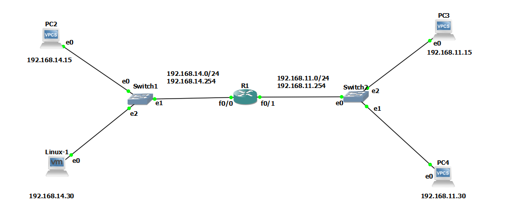
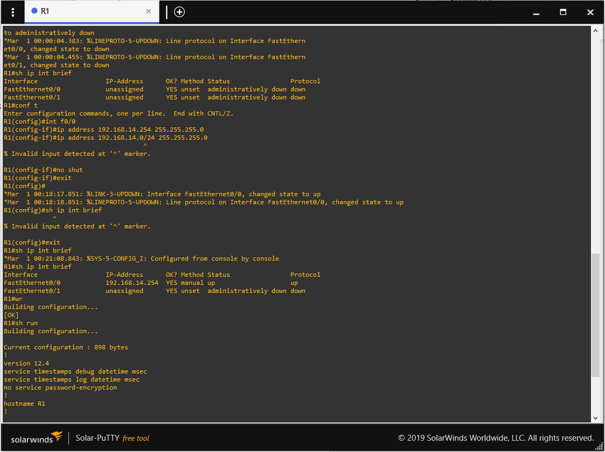
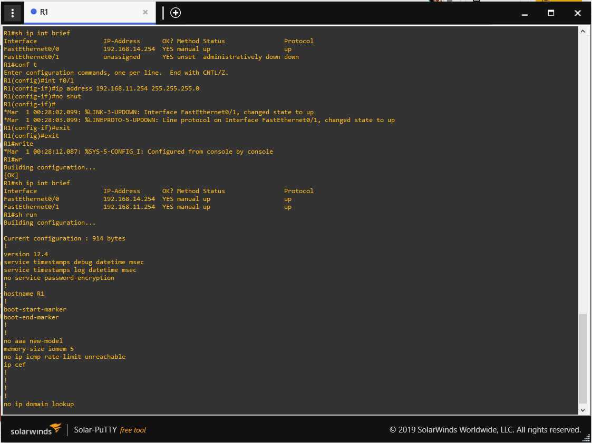
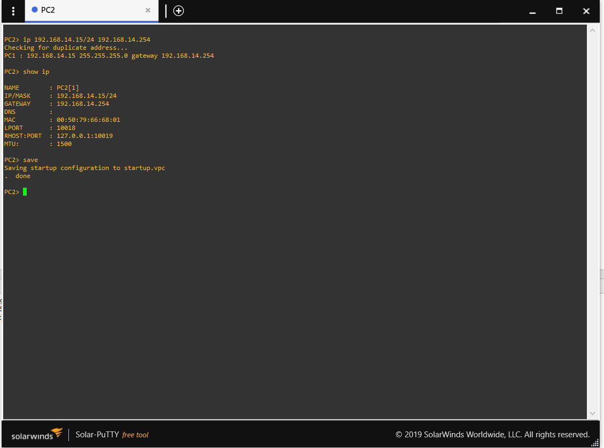
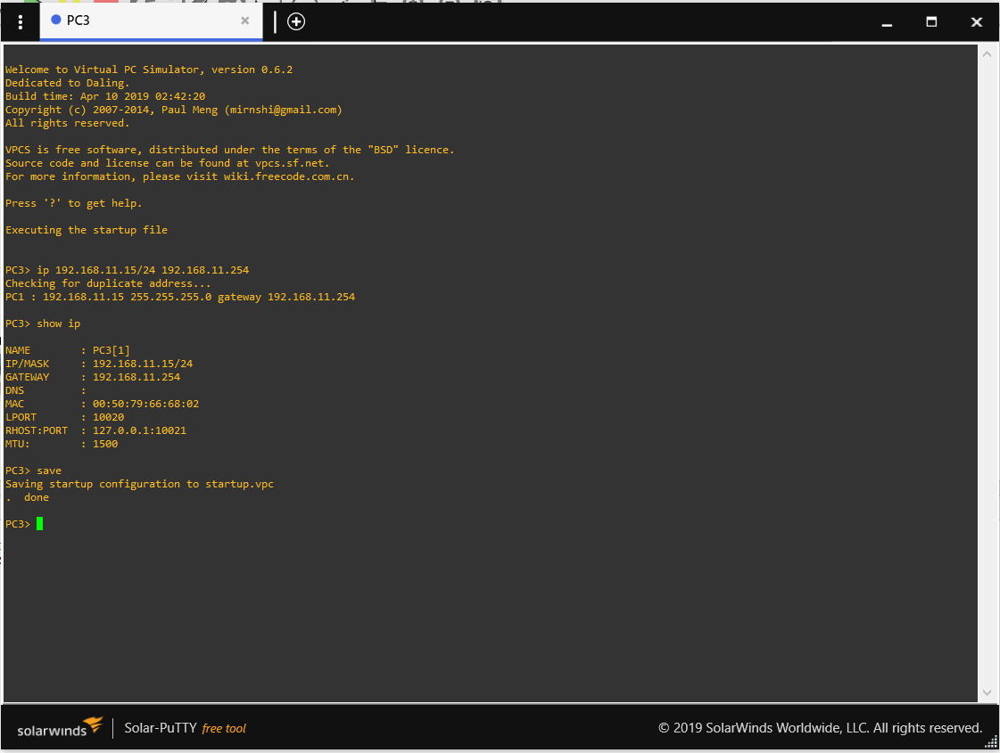
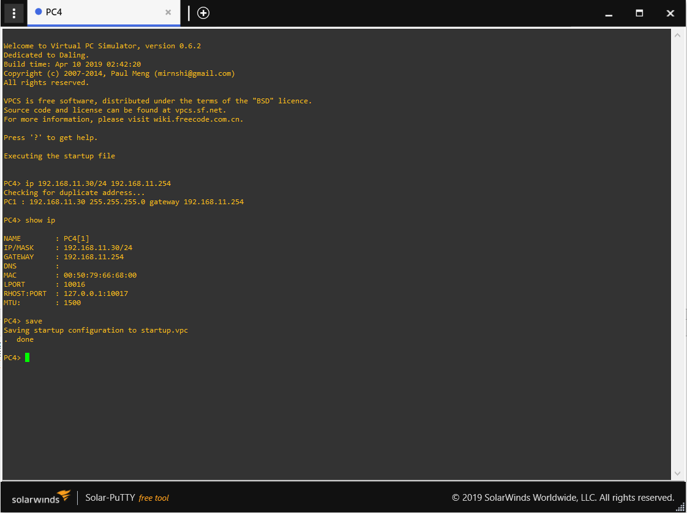
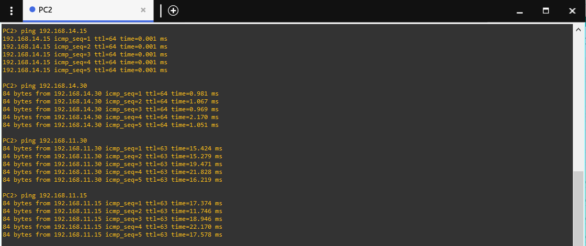

# Practica 1 - Redes de computadoras 1

Esta practica consiste en la configuración y administración de dispositivos en una infraestructura de red para una compañia que esta buscando crecer implementando la misma. Se mostraran las configuraciones necesarias para el funcionamiento adecuado de la topologia.

Las configuraciones necesarias para poder realizar esta practica, seran mostradasa continuacion paso a paso. 
## Configuración de la topologia
  - Paso 1
  Armamos la topologia como se muestraa continuacion, para luego poder ir realizando las diferentes configuraciones que se describiran. 
  
  - Paso 2
  Procedemos con la configuracion del router, para esto vamos a configurar las interfaces. Los comandos a ingresar son:
    * conf t <--- para iniciar en modo de configuracion
    * int f0/0 <-------- Para seleccionar la interfaz a asignarle la ip
    * ip address 192.168.14.254 255.255.255.0 <---- definimos la direccion ip 
    * no shut
    * exit <------ salimos del modo de configuracion
    * rw <------ sirve para guardar todos los cambios
    * sh run 

  - Paso 3
  Realizamos lo mismo que en el paso 2, solamente que se cambia a int f0/1 y la direccion ip seria 192.168.11.254 255.255.255.0

  - Paso 4
  Procedemos a configurar la maquina virtual, solamente accedemos a panel de contorl luego network y en IP Address le asignamos la direccion IP: 192.168.14.30 y le damos en apply para ver que los cambios de han guardado. 

  - Paso 5
  Procedemos a configurar VPC2, el comando a  utilizar es: ip direccion_ip/mascara_subred gateway, en el caso de esta seria 192.168.14.15/24 192.168.14.254. 

  - Paso 6
  Procedemos a configurar VPC3, el comando a  utilizar es: ip direccion_ip/mascara_subred gateway, en el caso de esta seria 192.168.11.15/24 192.168.11.254. 

  - Paso 7
  Procedemos a configurar VPC4, el comando a  utilizar es: ip direccion_ip/mascara_subred gateway, en el caso de esta seria 192.168.11.30/24 192.168.11.254. 

  - Paso 8
 Finalmente procedemos al respectivo Ping, para comprobar que la configuracion fue hecha de forma correcta. 

### Glosario
A continuación se mostrara un glosario, en donde se encuentran palabras clave para comprender de una mejor forma el funcionamiento de esta infraestructura de red.

| Plugin | README |
| ------ | ------ |
| Router | Es un dispositivo que permite interconectar computadoras que funcionan en el marco de una red. Su función: se encarga de establecer la ruta que destinará a cada paquete de datos dentro de una red informática. |
| Switch | Es un dispositivo de interconexión utilizado para conectar equipos en red formando lo que se conoce como una red de área local (LAN) y cuyas especificaciones técnicas siguen el estándar conocido como Ethernet  |
| Host | Se usa en informática para referirse a las computadoras u otros dispositivos (tabletas, móviles, portátiles) conectados a una red que proveen y utilizan servicios de ella.|
| IP | Se trata de un estándar que se emplea para el envío y recepción de información mediante una red que reúne paquetes conmutados. |
| Gateway | Es un dispositivo, con frecuencia un ordenador, que permite interconectar redes con protocolos y arquitecturas diferentes a todos los niveles de comunicación. |
| Mascara de subred | Indica qué parte de la dirección IP pertenece a la subred a la que se encuentra conectado el equipo.  |
| Red | Es un conjunto de equipos nodos y software conectados entre sí por medio de dispositivos físicos o inalámbricos que envían y reciben impulsos eléctricos, ondas electromagnéticas o cualquier otro medio para el transporte de datos, con la finalidad de compartir información, recursos y ofrecer servicios. |
| Topología | Es la rama de las matemáticas dedicada al estudio de aquellas propiedades de los cuerpos geométricos que permanecen inalteradas por transformaciones continuas. |
| Topología | Se entiende como infraestructura de red a todos aquellos elementos básicos e imprescindibles para cualquier instituciónu que precise todos o algunos de os siguientes servicios de telecomunicaciones: teléfono, fax, ordenador, escáner, impresoras, TPV, cámaras de control y vigilancia, control de accesos, datafonos, climatización, incendio, etcétera.. |
| Ping | Ees considerado un comando o una herramienta de diagnóstico que permite hacer una verificación del estado de una determinada conexión de un host local con al menos un equipo remoto contemplado en una red de tipo TCP/IP. |
